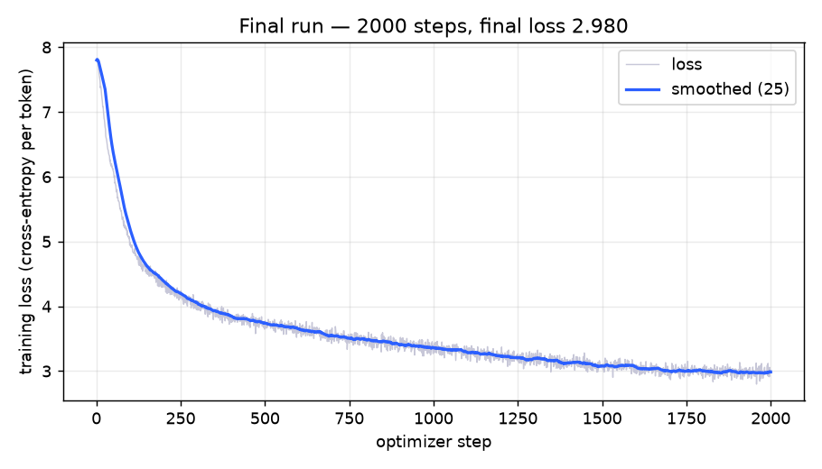

# plivo-ml-24115141 — 2000-step LLM speedrun

A small GPT trained from scratch on a mixed English+Hindi corpus, CPU-only, under
hard caps: ≤2000 optimizer steps and ≤2,000,000 parameters. Scored by bits-per-byte
on held-out text.

## Layout
- `model.py`, `tokenizer.py`, `train.py`, `evaluate.py` — the submission (what gets graded).
- `starter/` — the untouched handout, kept for reference.
- `data/` — the provided `train_corpus.txt` and `dev_eval.txt` (not committed).
- `RUNLOG.md` — every run: hypothesis, change, dev bpb before/after, conclusion.
- `NOTES.md` — the final config in ≤10 sentences.

## Final model

Dev bpb **1.6722** (baseline 2.3718, −29.5%), exactly 2000 steps, **1,863,840 params** (< 2M cap).

| | |
|---|---|
| tokenizer | byte-level BPE, vocab 2048, Devanagari-aware + leading-space, byte fallback (~3.36 bytes/token) |
| architecture | 5 layers, d=160, 4 heads; RoPE, RMSNorm, SwiGLU (ratio 2.667), bias-free, tied embedding, scaled residual init |
| context | block size 128 |
| optimizer | AdamW(0.9, 0.95), wd 0.1 (matmuls only), grad clip 1.0 |
| schedule | warmup 100 → cosine to 1e-4, peak lr 3e-3 |
| batch / steps | 48 / 2000 |

Training loss (final run, raw + 25-step moving average):



## Reproduce
```
python tokenizer.py --data data/train_corpus.txt --vocab_size 2048 --out tokenizer.json
python train.py --data data/train_corpus.txt --steps 2000 --batch 48 --lr 3e-3 \
  --min_lr 1e-4 --warmup 100 --wd 0.1 --clip 1.0 --schedule cosine --optimizer adamw \
  --tie_weights 1 --n_layer 5 --n_head 4 --n_embd 160 --block_size 128 \
  --pos_type rope --norm_type rmsnorm --mlp swiglu --mlp_ratio 2.667 --bias 0 \
  --scale_residual 1 --eval_every 500 --out ckpt.pt
python evaluate.py --checkpoint ckpt.pt --text_file data/dev_eval.txt
```
The evaluator command works unmodified from inside this folder. Seed is 1337 and the
batch sampler is seeded, so a run reproduces given the same flags. The tokenizer is
lossless (`decode(encode(text)) == text`) with a raw-byte fallback for any UTF-8.
`checkpoints/` holds the checkpoint behind every RUNLOG number with the tokenizer each used.
